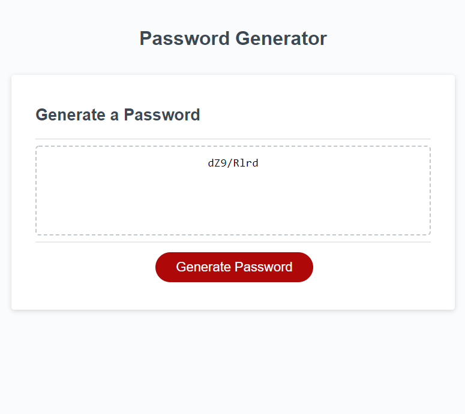

# Challenge - Module 3. JavaScript.

In this challenge we modify a starter code and create a random password generator.

## Application functionality

* The user specifies which characters wants to include (lowercase, uppercase, number and special characters). It has to have at least one selected.

* It has a minimum of 8 characters and a maximum of 128. If it's out of range you can't continue with the password generator.

* It is a responsive interface.

## The Work

* Functions. Practice global and local scope.

* Use of conditional statements.

* Comparitions with the logical and operator.

* Arrays and the method concat.

* Follows best practices for file structure, naming, indentation, etc.

## Techs

* Html, advanced CSS.

* JavaScript

## Link to the application

* [Visit the application here!](https://qgtere.github.io/)

## Mock-up

 

---

© 2022 Trilogy Education Services, LLC, a 2U, Inc. brand. Confidential and Proprietary. All Rights Reserved.
